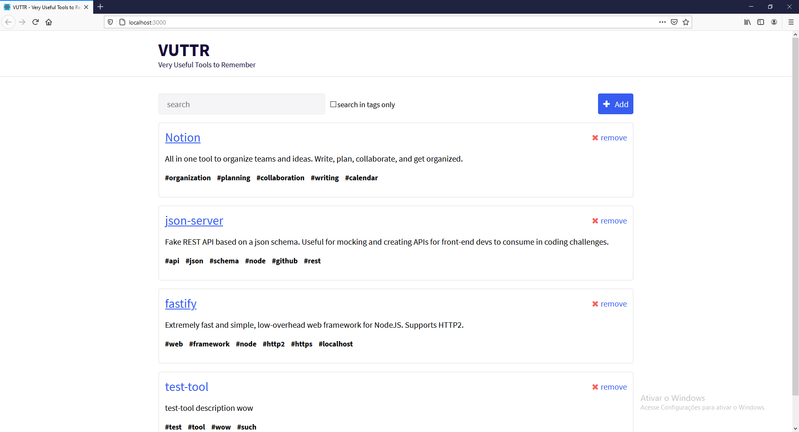
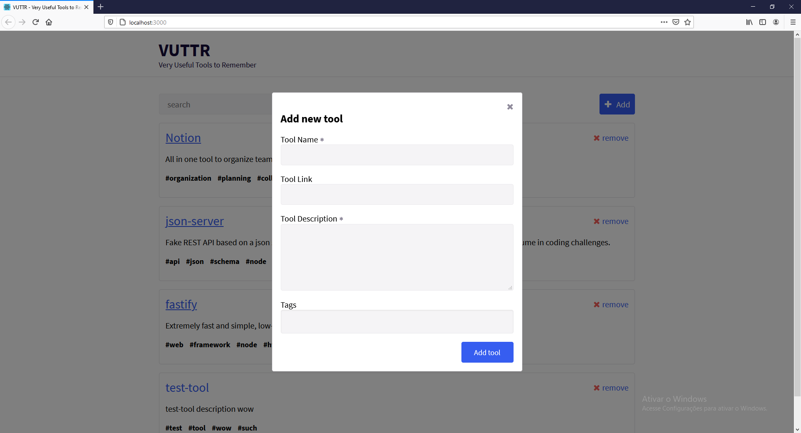
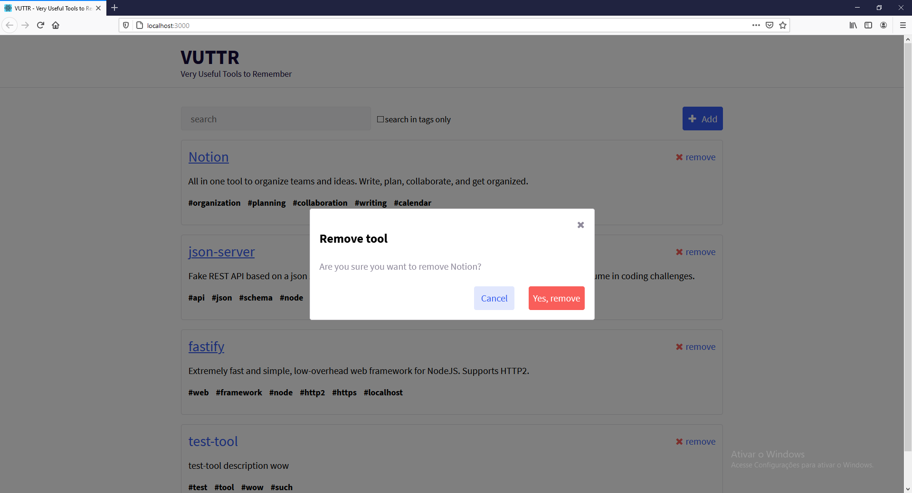

# React Sample application

A Single Page Application that lists Tools and allows to create and remove tools. No CSS libraries used, all components custom styled.

It uses:

- React JS
- Styled components
- Hooks
- Proptypes
- Axios
- Formik
- json-server
- ESLint

## How to run

```
npm install

npm run dev
```

## Screenshots





## Video

[Video showing the App](https://youtu.be/uOVzQuI1IP0)
